```{r echo=FALSE}
knitr::opts_chunk$set(echo = TRUE, fig.align="center")
```


# Introduction 


Coronavirus disease (COVID-19) is an infectious disease caused by a newly discovered coronavirus. Most people infected with the COVID-19 virus will experience mild to moderate respiratory illness and recover without requiring special treatment. Older people, and those with underlying medical problems like cardiovascular disease, diabetes, chronic respiratory disease, and cancer are more likely to develop serious illness.

The COVID-19 virus spreads primarily through droplets of saliva or discharge from the nose when an infected person coughs or sneezes. With such similar symptoms to a common “cold”, this virus outbreak has spread to more than 200 countries and regions, affecting more than 60,000,000 people around the world, with more than 50% of recovery rate. In addition, it has also swept out more than 1,400,000 deaths, as of November 2020.

Presently, there are no vaccines available globally to protect against this virus, and the best way to prevent and slow down transmission is to be well informed about the COVID-19 virus, the disease it causes and how it spreads. In due of that, it will be significant to analyse the spread of COVID-19, understand where, when, and how it occurred by studying the spatio-temporal patterns of confirmed, recovered and death cases. 


# Motivation & Objectives


In due of the limited resources of COVID-19 data Singapore has to offer, we have decided to shift our focus to China where the first COVID-19 case was identified in November 2019. We’ve acquired data from *Harvard Dataverse* featuring daily updates from the period of January to September 2020 of COVID-19 China confirmed, recovered, dead and foreign* cases. Together with these data, we will be able to do an in-depth analysis of the spatio-temporal patterns of the disease spread and understanding it could greatly improve and deter the size of this threat.

Furthermore, we aim to provide a web-based geospatial application with a web-enabled geospatial analytical tool to identify areas with COVID-19-related cases and pinpoint the factors affecting the spread. Particularly, this project will focus on the following objectives:

1. Visualize amount/density of the cases by performing relevant exploratory data analysis;
2. Conduct global and local spatial analysis to uncover spatial correlation patterns and its influencing factors;
3. Create a web-based interface through R Shiny with relevant user inputs to display relevant data analysis; The application will comprise(s) of the following analysis requirements: 
  
    *   Graphical/Geographical visualization framework that can display the amount/density of the COVID-19 cases over time;
    *   Map visualization framework that supports macro and micro views;
    *   Customizable analysis based on-demand through user’s input.

On the whole, we can evaluate results based on the findings, better plan and provide recommendations to further mitigate its spread.

*Foreign cases will not be analyzed in this paper as we are only focusing on the spread towards the country and its residents. 


# Related Work


Multiple studies regarding COVID-19 in China have been conducted after the first outbreak in Wuhan City. A study studied the spatial autocorrelation and factors of COVID-19 on a provincial level using methods such as Global Moran I, Local Moran I, Gertis-Ord Gi*.

The Global Moran I, will be used to measure the spatial characteristics of cases in the entire region, analysing the overall spatial correlation and differences between the regions. If Moran’s I statistics shows a positive correlation, it implies that there is spatial clustering. Likewise, a negative correlation will imply a checkerboard spatial pattern. Local Moran’s I was later used to study correlation patterns between regions. Gertis-Ord Gi* then identifies the spatial association between the hot and cold spots that is statistically significance. These statistical methods are relevant and should be incorporated to our GEOVID application.

Another similar study was done on the spatial and temporal differentiation of Covid-19 in China and its influencing factors. Like the previous study, uses Global Moran I, Spatial Weight Matrix and Local Moran’s I. These statistical methods were also used to study the spatial correlation in China and its regions.

Based on these two research papers, Global Moran I and Local Moran I were used to analyse the spatial correlation of Covid-19 in China. These analysis methods will give a guide of relevant statistics methods for our GEOVID application.


# Research Methods


As previously mentioned, Global Moran I and Local Moran I are statistical methods often used to study the spatial correlation regarding Covid-19 cases. As such, for the GEOVID application, both Global and Local Moran will be incorporated it the analysis. In addition, spatial weight matrix will also be used in the Local Moran statistical Analysis to define the neighbour. 


## Global Moran's I


Global Moran I is a statistical method used to calculate the relationship between factors to its surrounding area. It evaluates if patterns are clustered, dispersed, or random. It also calculates the x score and p-value to find out the significance of index. P-value and z-score will prove is the null hypothesis is statistically significant. If the p-value is small and z-score falls outside the confidence level, null hypothesis will be rejected, proving that spatial patterns is statistically significant. The index value will indicate signs of spatial patterns, specifically, index near +1 would indicate clustering pattern while –1 would indicate dispersion.

The formula for Global Moran's I is as followed:

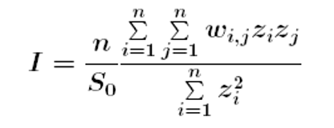\
\begin{center}
Figure 1: Global Moran's I algorithm
\end{center}

In this study, Global Moran will be used to measure the spatial correlation of Covid-19 rates per 10,000 people, to the whole of China. Moran.test() and monte carlo simulation will be done to determine the significance of spatial patterns present. 


## Local Moran's I


Local Moran I is a local spatial autocorrelation analysis method based of Global Moran I. Local Moran I study the relationship between region, in this case, between cities in China. It also identifies the spatial outliers. Positive Local Moran index would suggest that region is surrounded with similar values, which will be identified as a cluster, while a negative index would suggest that region is surrounded by dissimilar values, which could be identified as an outlier.

The formula for Local Moran’s I is as followed:

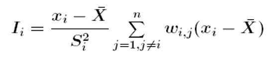\
\begin{center}
Figure 2: Local Moran's I algorithm
\end{center}

In this study, Local Moran’s I will be used to measure the local spatial correlation of Covid-19 rates per 10,000 people to cities in China. 


# Approach


## Data Collection


Data of the coronavirus virus spread in China (January to September, 2020): Confirmed, Recovered and Death cases, Population Data (2010)* in Tab-Delimited format, China City/Province basemaps in Shapefile (SHP) format, are obtained from *Harvard Dataverse: China COVID-19 Daily Cases with Basemap*. 

*Kindly take note that population data after year 2010 of each city are not readily available online as most of the sources only provide population data based on province or as an overall count instead. Therefore, we will make use of the population data of year 2010 given in the dataset above. 


## Data Cleaning and Wrangling


For all the respective data: Confirmed, Recovered and Death cases, we will only need to extract the daily count based on the date that the data was recorded. We will be focusing only from January to September 2020 as these datasets are the most complete range in the originals. In addition, duplicates will also need to be checked and removed to prevent skewed data analysis. Standardization of data, such as, ensuring columns of each data files and their data types are the same before reclassifying selected columns, is conducted. Consequently, it will then produce an unbiased comparison and analysis.


# System Architecture


Our application is built using R programming language, a widely used language among statisticians and data miners for developing statistical software and data analysis. We’ve constructed it upon an integrated development environment (IDE), Rstudio application, due to its extensive availability of R packages that we could import and deliver ease in developing our system architecture. Moreover, our application will be deployed to Shiny.io for further user interactions through their own private browser. 

R Packages used for application development as below: 

```{r echo=FALSE, message=FALSE}
library(dplyr)
library(knitr)
library(kableExtra)

rpkg.a <- c("sp", "spatstat", "lubridate", "rgdal", "rgeos", "dplyr", "tmap")
rpkg.b <- c("sf", "tidyverse", "leaflet", "raster", "rsconnect", "ggplot2", "shiny")
rpkg.c <- c("spdep", "tidygeocoder", "classInt", "readxl", "maptools", "ggpubr", "shinythemes")

rpkg <- cbind(rpkg.a, rpkg.b)
rpkg <- cbind(rpkg, rpkg.c)
rpkg <- data.frame(rpkg)
```

```{r echo=FALSE, message=FALSE, warning=FALSE}
rpkg %>%
  kbl(col.names = NULL) %>%
  kable_paper("hover", full_width = F)
```


# Application

## User Interface Design


Our application consists of 3 tabs which will lead our user to the exploratory data analysis, spatial autocorrelation analysis and full detailed dataset that the application uses to analyze the results. 

On the Exploratory Data Analysis (EDA) page, there are 3 additional sub-sections, namely Line Graph, Choropleth, and Box Map. As seen below from the following figures[-], line graph is used to analyze the daily and cumulative count of COVID-19 cases over the priod of months from January to September 2020, choropleth mapping is used to view the geographical distribution of the spread at provincial-cities level, and box mapping to visualize the outliers using the interquartile range of the COVID-19 rate based on the total number of cases and the total number of population in each city. 

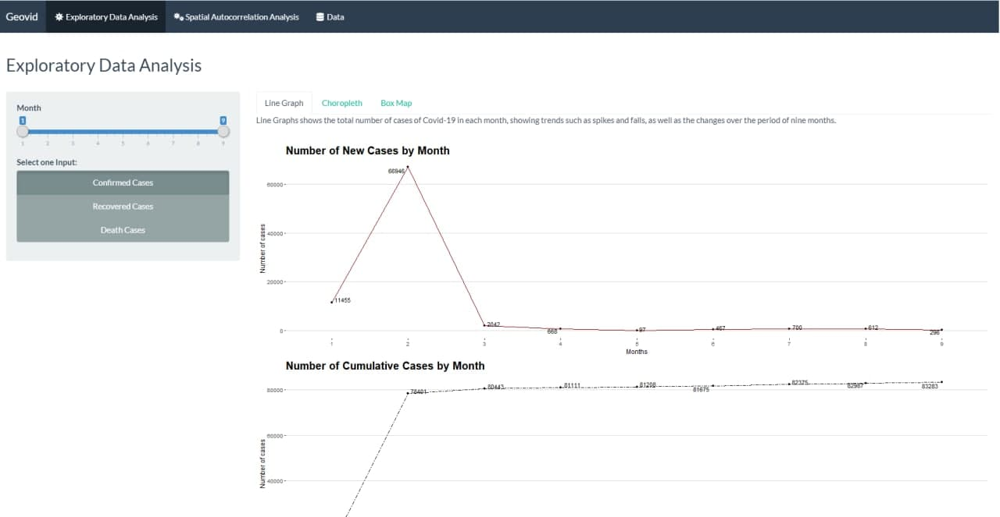\
\begin{center}
Figure -: EDA Line Graph User Interface Design
\end{center}
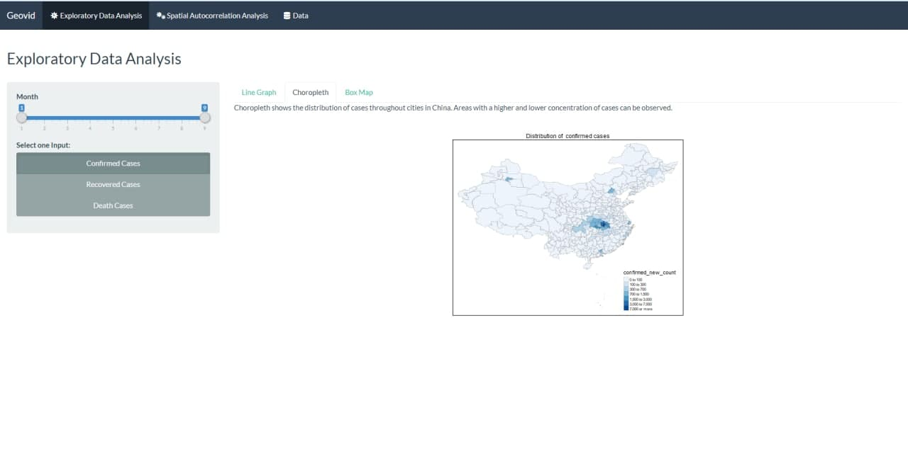\
\begin{center}
Figure -: EDA Choropleth User Interface Design
\end{center}
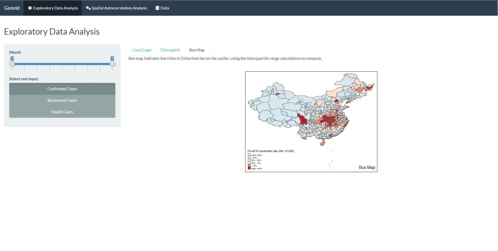\
\begin{center}
Figure -: EDA Box Map User Interface Design
\end{center}


Moving on to the Spatial Autocorrelation Analysis page, 

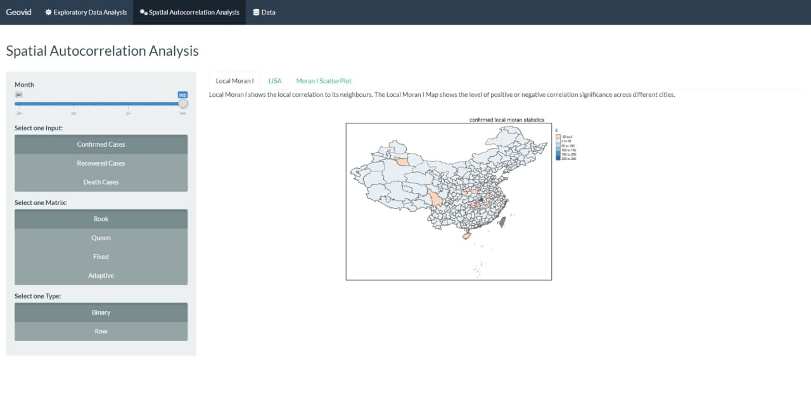\
\begin{center}
Figure -: Spatial Autocorrelation User Interface Design
\end{center}


Lastly, on the Data page, it will showcase the data in a table format where the user will be able to view the raw data that is used for our analysis. 

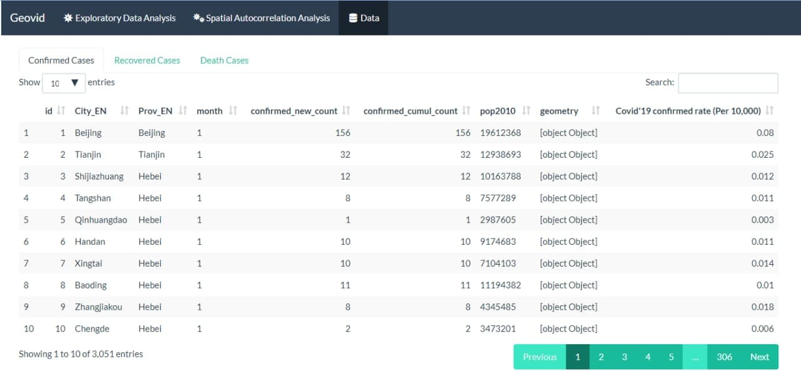\
\begin{center}
Figure -: Data Outlook User Interface Design
\end{center}


## Filters & Components

### Exploratory Data Analysis (EDA) Tab


User will be able to filter the data by period of months they want to analyze and the data type(s): Confirmed, Recovered and Death they wish to view. 

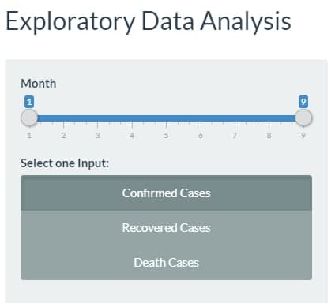\
\begin{center}
Figure -: EDA User Input
\end{center}

<!-- Within EDA, there are 3 different analysis the user is able to view. There are line graphs for daily and cumulative number of cases based on the months input, choropleth mapping for the geographical distribution of the spread of COVID-19 and lastly, box map to analyze extreme values and outliers. -->

\
\begin{center}
Figure -: EDA Tabs
\end{center}


### Spatial Autocorrelation Analysis Tab


Similarly, user will be able to filter the data by period of months they want to analyze and the data type(s): Confirmed, Recovered and Death they wish to view. In addition, user will also be able to choose the neighbourhood matrix and standardization type for spatial autocorrelation analysis such as local moran's I and global moran's I.

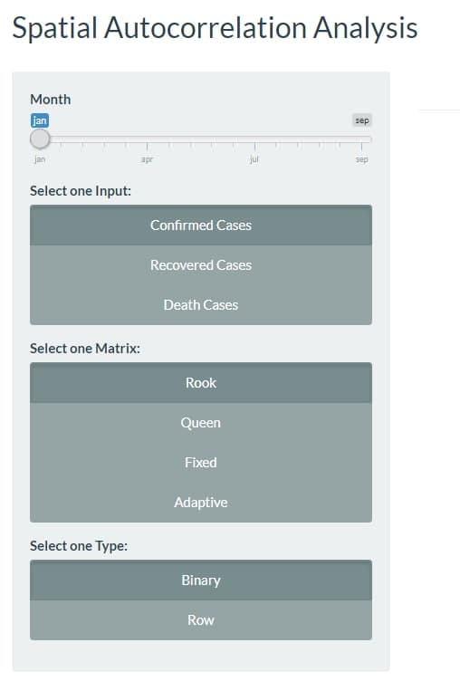\
\begin{center}
Figure -: Spatial Autocorrelation User Input
\end{center}


# Results

## Exploratory Data Analysis

### Confirmed Cases

The Line Graph of Confirmed Cases below visualized the New cases and Cumulative cases of COVID-19 occurred in the respective x-Axis over the timeline of months between January to September 2020 in y-Axis, which based on the observation figure [] below, the initial count of the new daily cases started off with 11455 in January and had a steep increase to 66946 cases in February, and in the month of March onwards, there has been a drop and remained steadily since then. While for cumulative cases, upon reaching 78401 cumulative cases in February, the incoming new daily cases have been greatly reduced. 

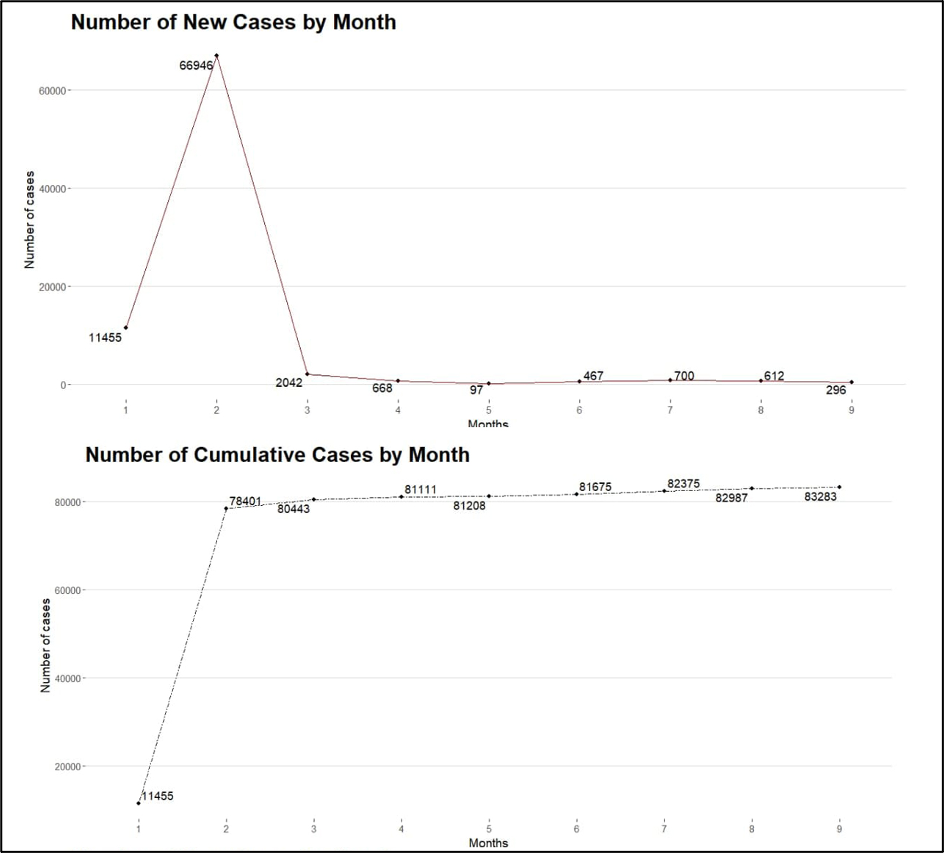\
\begin{center}
Figure -: Line Graph of Confirmed Cases
\end{center}

Moving on, based on the choropleth mapping figure [] below, represents the defined aggregation of density in the confirmed cases of each individual city, differentiating by the months of January, April, July and September. The cluster started off from the china city of Wuhan and it spread to the neighbouring cities overtime. 

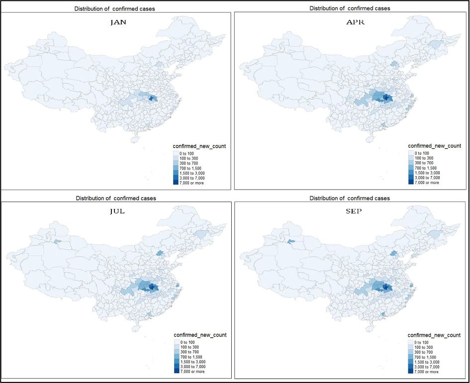\
\begin{center}
Figure -: Choropleth of Confirmed Cases
\end{center}

After looking at the results of the choropleth mapping above, let us take a look at the box map of confirmed cases and analyze its outliers. Box map of confirmed cases generally shows the changes across the months, by filtrating its data into the relevant interquartile range. 
<!-- The box map of confirmed cases shows the changes in the rate of COVID-19 recovered cases across the four different months in China, using the calculations from interquartile range, categorizing areas into each range.  -->

As shown in figure [] below, box map in the month of January shows the least number of areas lying in the upper outlier range. The number of areas in the upper outlier range increase as the months go by, with the most areas in the month of September. The increase in the areas of the upper outlier region suggests that it sees an increase in areas that may rise in the confirmed number of COVID-19 cases in China.


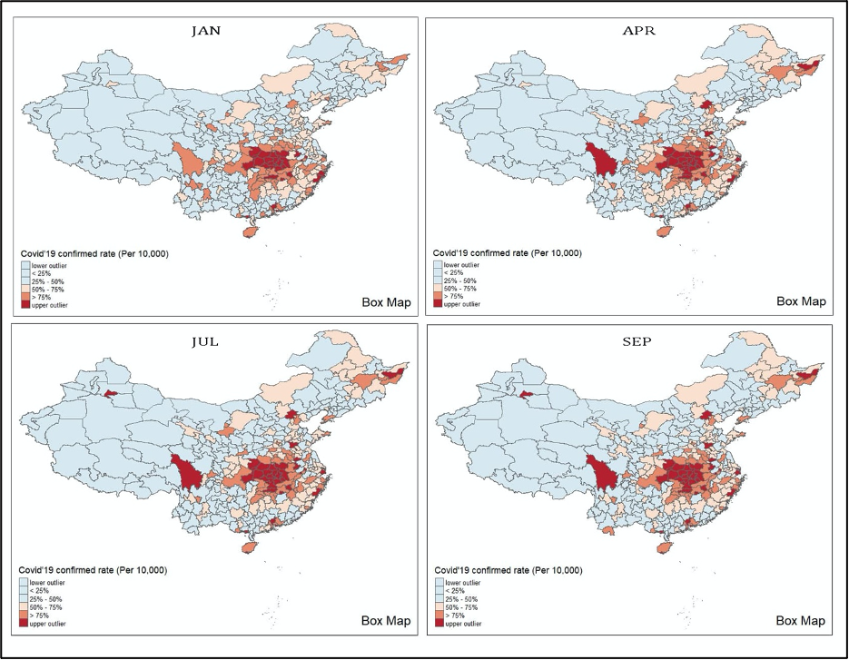\
\begin{center}
Figure -: Box Map of Confirmed Cases
\end{center}


### Recovered Cases


<!-- While there is a high volume of new COVID-19 cases happening, there are also a great deal of a number of successful cases recovered between January and March which allows rooms for preparation. And if based on the cumulative cases by month, the total number of death toll when falls on march, which has already hit a record high of 75189 cases.  -->

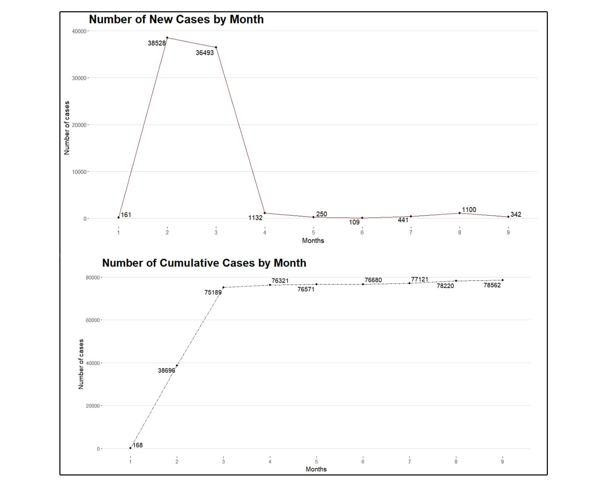\
\begin{center}
Figure -: Line Graph of Recovered Cases
\end{center}

The choropleth mapping below shows the distribution of recovered cases in China. Based on Figure [], it can be seen that there is an increase in the number of recovered cases throughout China from January to September.  Although there is a clear increase in the number of recovered cases in Wuhan and its surrounding areas, there are also other areas in China that has also seen this increase, which would probably be due to the increase in the number of confirmed cases in those respective areas.

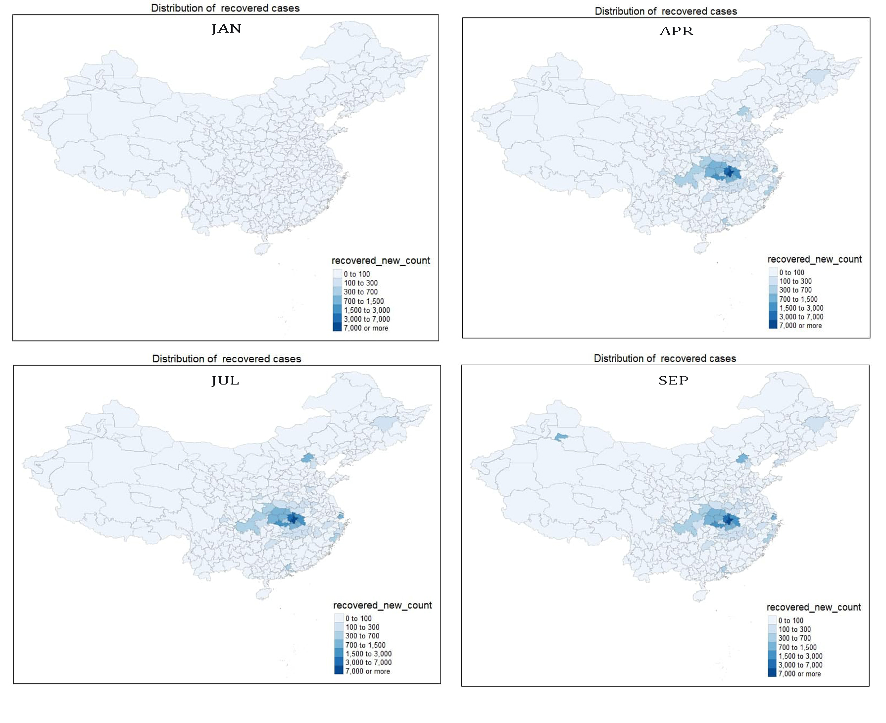\
\begin{center}
Figure -: Choropleth of Recovered Cases
\end{center}

Moving forward on to the box map for recovered cases, it shows the rate of COVID-19 cases across 4 different months in China. 

As observed from Figure [] below, the map shows high rates of recoveries at cities such as Wuhan, which lies in the upper outlier range. The number of areas that lies in the upper outlier range increases over the progression of time. While this implies that this area sees a higher number of recovery rates, it does not mean that this is due to a better health care or related factors that lead to the increase in rate of recovery, it simply means there are higher rates of recovery cases. It is important to consider the number of confirmed cases in these areas. Areas with high rate of recovered cases lying on the upper outlier usually have high rates of confirmed cases, which is the more probable explanation behind the high rate of recovery. 

In addition, the box map of January is the exception amongst the others, showing the entire China as upper outlier, this is due to the insufficient observations to determine the interquartile range. 

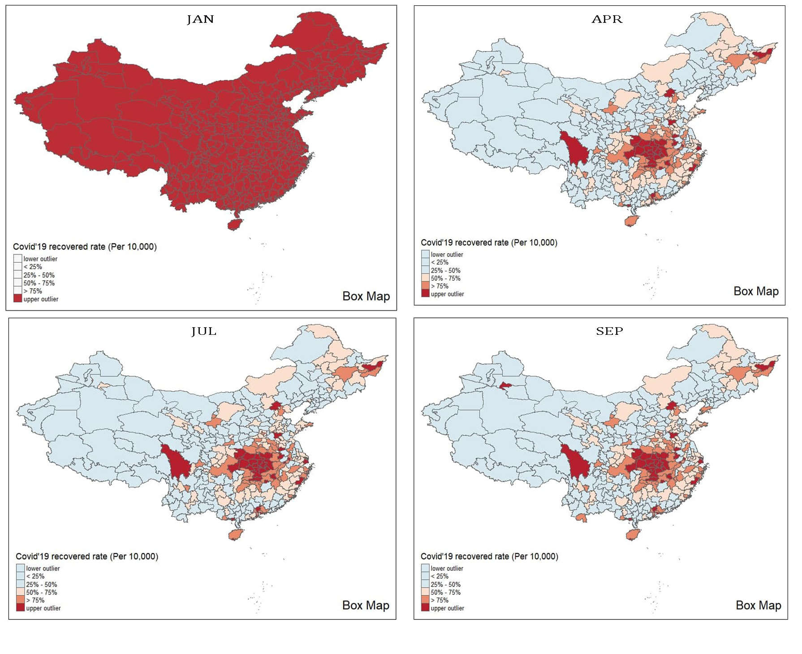\
\begin{center}
Figure -: Box Map of Recovered Cases
\end{center}


### Death Cases


Based on Figure [] below, it can be seen that it started off with 253 death cases in January, and followed by a spike of 2526 new death cases in February. 
<!-- As per monthly basis in the Line Graph of new cases, there are 253 death cases occurred during the month January, following by February which brought up to another 2526 new cases, and in the March and April as well which hit an accumulative of 4572 new cases over the Total confirmed cumulative numbers of 81111.  -->

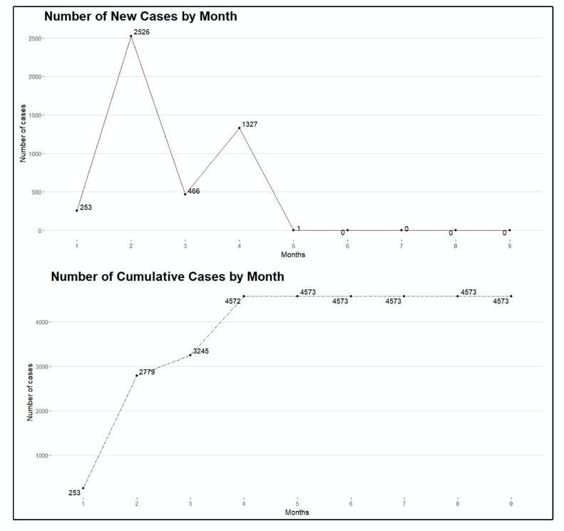\
\begin{center}
Figure -: Line Graph of Death Cases
\end{center}

The choropleth for death cases shows the distribution of death cases throughout China, which shows that the distribution of death cases to be concentrated at the Wuhan area. Throughout January, April, Jul & September, September sees the highest number of death cases concentrated in the Wuhan area, with a slight increase in cases in the surrounding areas. This is due to high number of confirmed cases in those regions. It is also important to note that Wuhan is the centre of the epidemic, which would explain why there is a higher number of Covid-19 deaths in that region, as it is still struggling to contain the newly discovered virus.

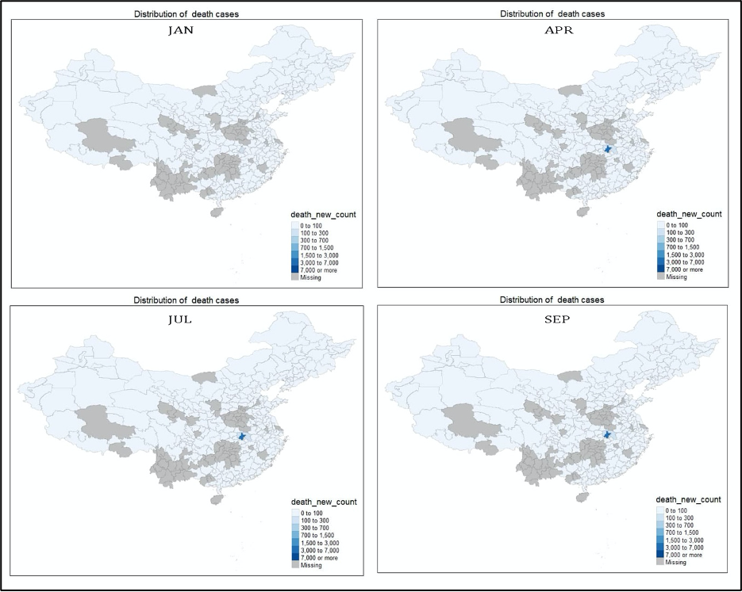\
\begin{center}
Figure -: Choropleth of Death Cases
\end{center}

The box map for the rate of death cases shows that all areas lies in the upper outlier. This is due to the insufficient number of death cases available. As such, it is important to do further spatial autocorrelation to analyse the presence of spatial patterns and clusters. 

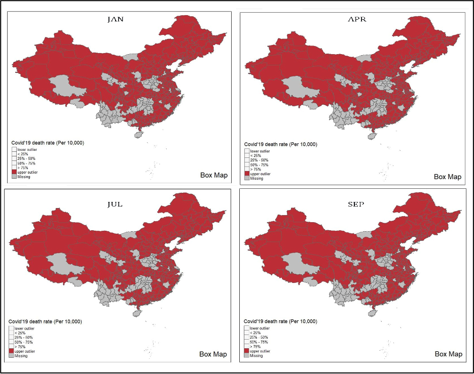\
\begin{center}
Figure -: Box Map of Death Cases
\end{center}


### Conclusion


## Spatial Autocorrelation Analysis 

To determine if clusters observed in the earlier choropleth is significant, local Moran I is used to compute the relationship between each region to its neighbour. The figure [] below shows the Local Moran's I of each respective type of cases based on the adaptive weight matrix. 

As observed from Figure [] below, Wuhan sees a significantly positive Local Moran's I statistic of confirmed cases rate. This also suggest that Wuhan is a spatial cluster that is significant, which means that its neighbours has a higher chance of being affected by the increase number of COVID-19 cases in Wuhan.

On the other hand, the areas that shows a negative Local Moran's I statistic implies that there is no relationship between itself and its neighbour, suggesting that COVID-19 cases in those areas do not affect its neighbours. 

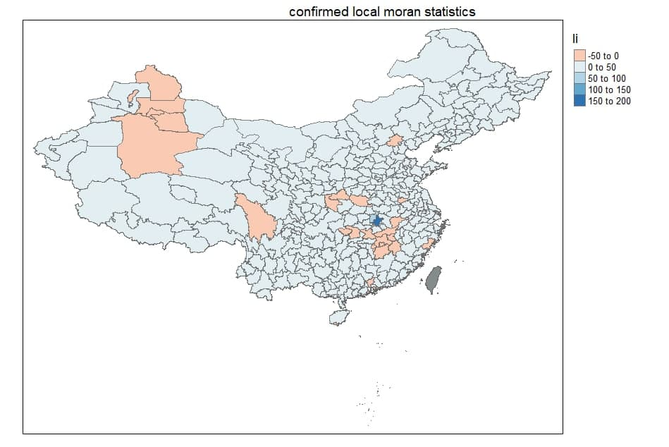\
\begin{center}
Figure -: Local Moran's I for Confirmed Cases
\end{center}

Moving forward, the figure [] below shows the recovered cases in Wuhan having a positive local Moran I statistics, which imply that there is enough evidence to conclude that Wuhan is a spatial cluster. This also suggest that recovered COVID-19 cases in Wuhan highly affects the number of recovered cases in its neighbouring areas.

On the contrary, the negative local Moran's I statistics suggest that the recovered rate in these areas are not highly affect its neighbour.

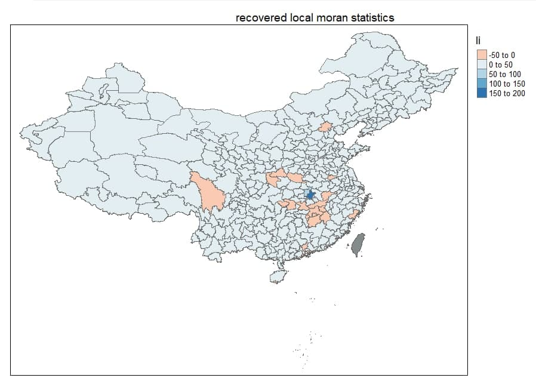\
\begin{center}
Figure -: Local Moran's I for Confirmed Cases
\end{center}

As observed from Figure [], the death rate in Wuhan shows a significant evidence of spatial cluster, suggesting that its death rate will greatly affect its neighbouring areas. The negative Local Moran's I areas implies that the death rate in the area will not greatly affect the death rate in its neighbouring areas. 

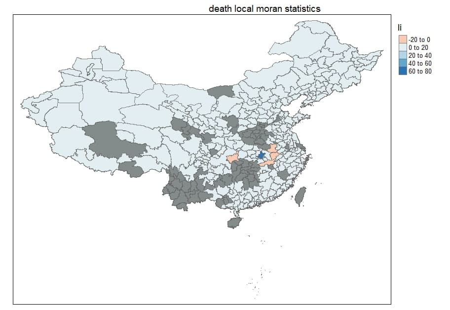\
\begin{center}
Figure -: Local Moran's I for Confirmed Cases
\end{center}


# Limitations


## Incomplete data 

The incomplete data in the datasets, namely, confirmed, recovered, and death, resulted in limited analysis. This is especially so for the death data, with several cities with no information recorded. This resulted in missing areas, which is apparent in the death choropleth, showing gaps in the map. 

## Computational Issues 

Although RStudio has multiple packages that was crucial in the analysis of this study, there were several computational limitations, namely, memory allocation issues. RStudio consumes large amounts of memory processes, resulting in the failure to run the relevant programs and data analysis for the analysis.  


# Discussion

Based on the various analysis that was done, a clear spatial cluster for confirmed, recovered and death cases can be clearly seen in Wuhan. This is due to Wuhan being the ground zero for COVID-19. However, despite being a highly infectious virus, the reason for the small cluster was due to the lockdown in Wuhan, which prevented further spread of the disease to its neighbouring areas.  

# Future Work

Despite the study being done on a smaller scale, a more in-depth analysis with more data would on a bigger scale allow forecasting on the potential areas that would be affected by the spread of Covid-19 cases. 

# Acknowledgement


The authors would like express our special thanks of gratitude to Dr. Kam Tin Seong, Associate Professor of Information Systems at School of Information Systems, Singapore Management University, for giving us the opportunity to take part in this research project and providing kind support and guidance throughout this journey.


# References

---
references:
- id: meier2012
  title: Professinal Android 4 Application Development
  author: 
  - family: Meier
    given: Reto
  type: book
  publisher: John Wiley & Sons, Inc.
  issued:
    year: 2012
    month: 5
- id: fenner2012a
  title: One-click science marketing
  author:
  - family: Fenner
    given: Martin
  container-title: Nature Materials
  volume: 11
  URL: 'https://doi.org/10.1038/nmat3283'
  DOI: 10.1038/nmat3283
  issue: 4
  publisher: Nature Publishing Group
  page: 261-263
  type: article-journal
  issued:
    year: 2012
    month: 3
...

