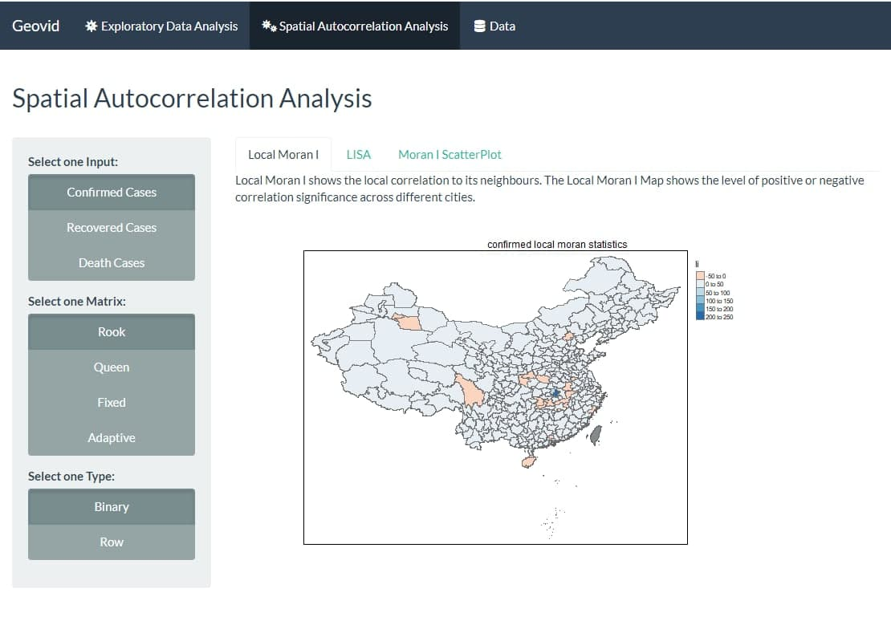
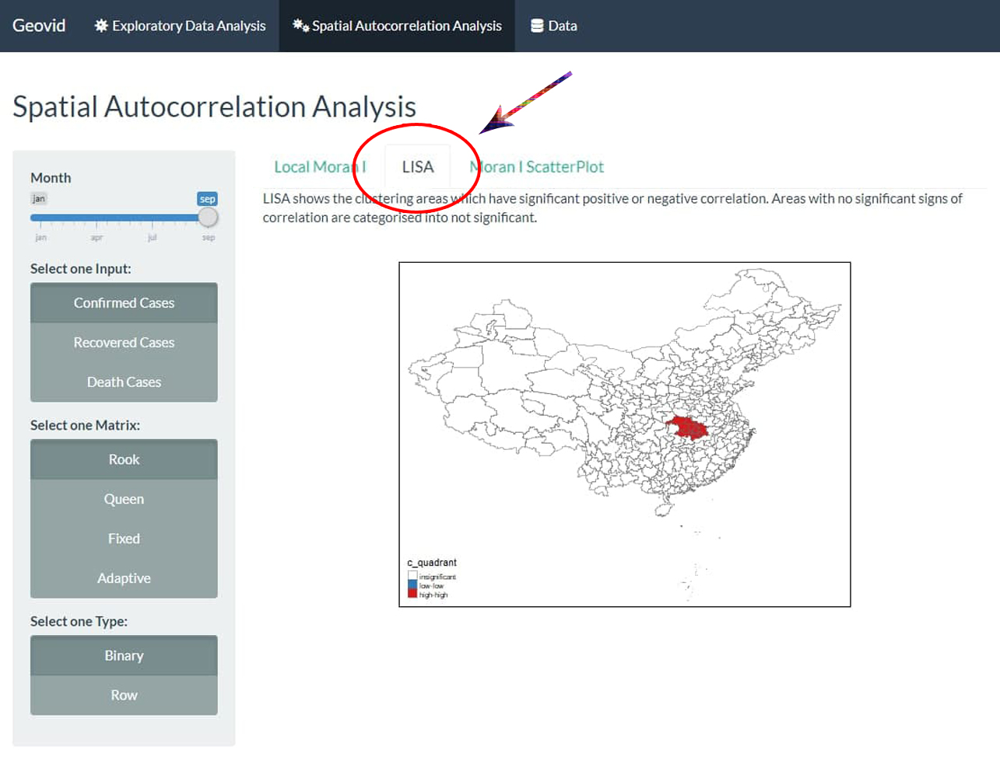
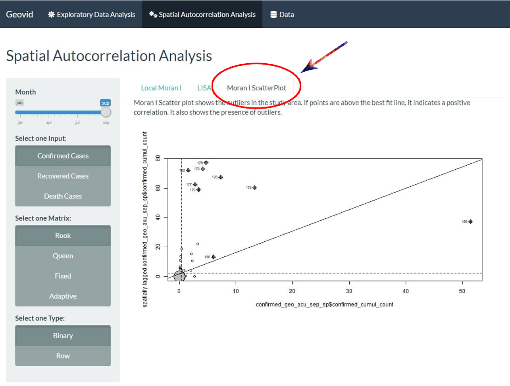
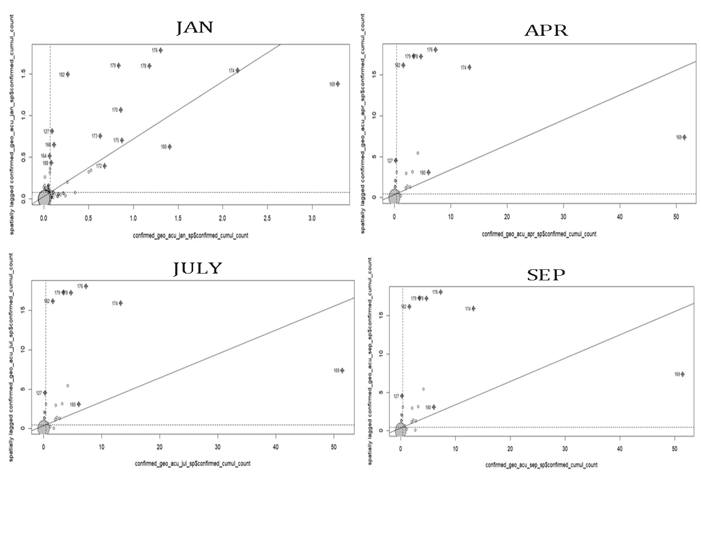
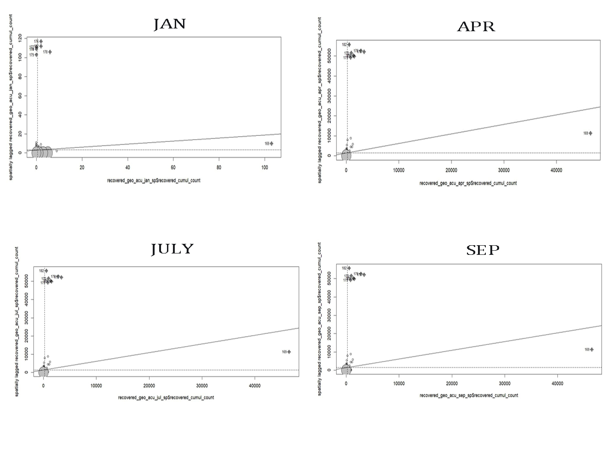
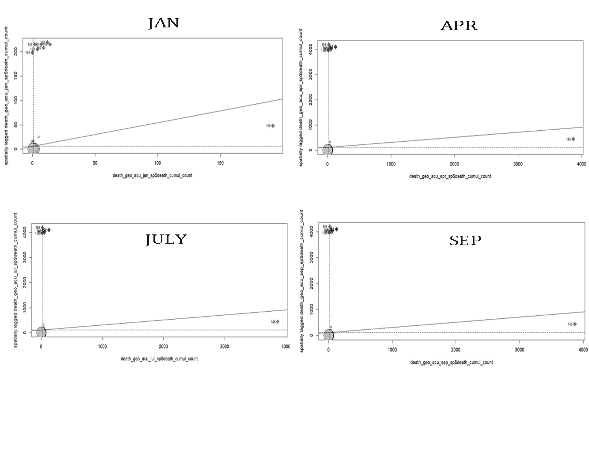
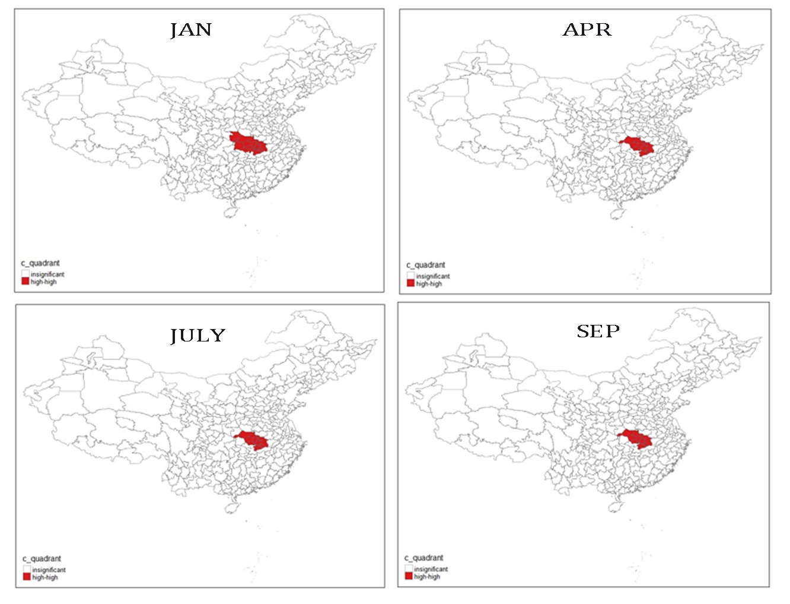
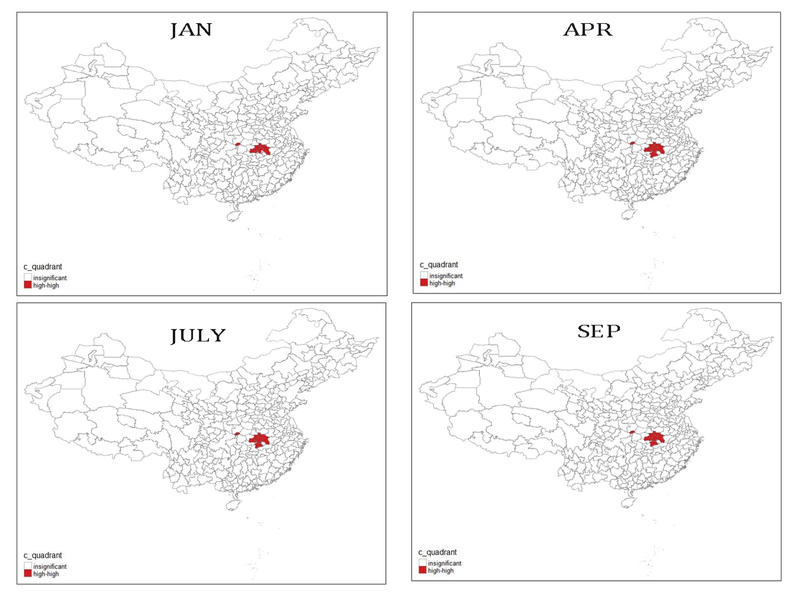
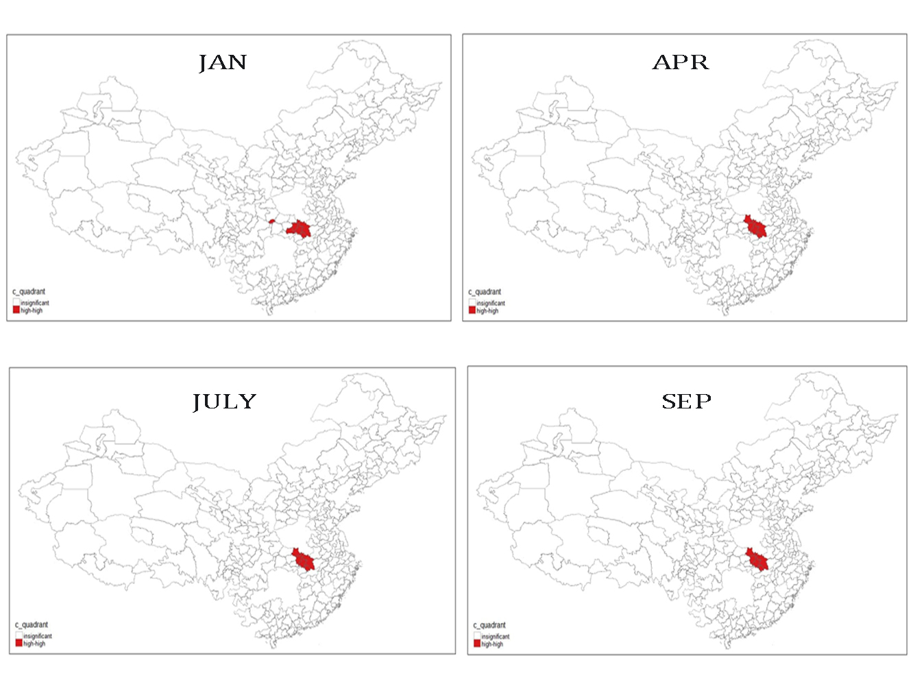

```{r echo=FALSE}
knitr::opts_chunk$set(echo = TRUE, fig.align="center")
```


# Introduction 


Coronavirus disease (COVID-19) is an infectious disease caused by a newly discovered coronavirus. Most people infected with the COVID-19 virus will experience mild to moderate respiratory illness and recover without requiring special treatment. Older people, and those with underlying medical problems like cardiovascular disease, diabetes, chronic respiratory disease, and cancer are more likely to develop serious illness.

The COVID-19 virus spreads primarily through droplets of saliva or discharge from the nose when an infected person coughs or sneezes. With such similar symptoms to a common “cold”, this virus outbreak has spread to more than 200 countries and regions, affecting more than 60,000,000 people around the world. In addition, it has also swept out more than 1,400,000 deaths, as of November 2020.

Presently, there are no vaccines available globally to protect against this virus, and the best way to prevent and slow down transmission is to be well informed about the COVID-19 virus, the disease it causes and how it spreads. In due of that, it will be significant to analyze the spread of COVID-19, understand where, when, and how it occurred by studying the spatio-temporal patterns of confirmed, recovered and death cases. 


# Motivation & Objectives


In due of the limited resources of COVID-19 data Singapore has to offer, we have decided to shift our focus to China where the first COVID-19 case was identified in November 2019. We’ve acquired data from *Harvard Dataverse* featuring daily updates from the period of January to September 2020 of COVID-19 China confirmed, recovered, dead and foreign* cases. Together with these data, we will be able to do an in-depth analysis of the spatio-temporal patterns of the disease spread and understanding it could greatly improve and deter the size of this threat.

Furthermore, we aim to provide a web-based geospatial application with a web-enabled geospatial analytical tool to identify areas with COVID-19-related cases and pinpoint the factors affecting the spread. Particularly, this project will focus on the following objectives:

1. Visualize amount/density of the cases by performing relevant exploratory data analysis;
2. Conduct global and local spatial analysis to uncover spatial correlation patterns and its influencing factors;
3. Create a geo-visualization tool through R Shiny with relevant user inputs to display relevant data analysis; The application will comprise(s) of the following analysis requirements: 
  
    *   Graphical/Geographical visualization framework that can display the amount/density of the COVID-19 cases over time;
    *   Map visualization framework that supports macro and micro views;
    *   Customizable analysis based on-demand through user’s input.

On the whole, we can evaluate results based on the findings, better plan and provide recommendations to further mitigate its spread.

*Foreign cases will not be analyzed in this paper as we are only focusing on the spread towards the country and its residents. 


# Related Work


Multiple studies regarding COVID-19 in China have been conducted after the first outbreak in Wuhan City. A study studied the spatial autocorrelation and factors of COVID-19 on a provincial level using methods such as Global Moran's I, Local Moran's I, Gertis-Ord Gi*.

The Global Moran I, will be used to measure the spatial characteristics of cases in the entire region, analyzing the overall spatial correlation and differences between the regions. If Moran’s I statistics shows a positive correlation, it implies that there is spatial clustering. Likewise, a negative correlation will imply a checkerboard spatial pattern. Local Moran’s I was later used to study correlation patterns between regions. Gertis-Ord Gi* then identifies the spatial association between the hot and cold spots that is statistically significance. These statistical methods are relevant and should be incorporated to our GEOVID application.

Another similar study was done on the spatial and temporal differentiation of Covid-19 in China and its influencing factors. Like the previous study, uses Global Moran's I, Spatial Weight Matrix and Local Moran’s I. These statistical methods were also used to study the spatial correlation in China and its regions.

Based on these two research papers, Global Moran I and Local Moran's I were used to analyze the spatial correlation of COVID-19 in China. These analysis methods will give a guide of relevant statistics methods for our GEOVID application.


# Research Methods


As previously mentioned, Global Moran's I and Local Moran's I are statistical methods often used to study the spatial correlation regarding COVID-19 cases. As such, for the GEOVID application, both Global and Local Moran will be incorporated it the analysis. In addition, spatial weight matrix will also be used in the Local Moran's statistical Analysis to define the neighbour. 


## Global Moran's I


Global Moran's I is a statistical method used to calculate the relationship between factors to its surrounding area. It evaluates if patterns are clustered, dispersed, or random. It also calculates the x score and p-value to find out the significance of index. P-value and z-score will prove is the null hypothesis is statistically significant. If the p-value is small and z-score falls outside the confidence level, null hypothesis will be rejected, proving that spatial patterns is statistically significant. The index value will indicate signs of spatial patterns, specifically, index near +1 would indicate clustering pattern while –1 would indicate dispersion.

The formula for Global Moran's I is as followed:

```{r mi_formula, echo=FALSE, out.width="100%", fig.cap="Global Moran's I algorithm", fig.show='hold'}
knitr::include_graphics("figures/global_moran_i_formula.png")
```

In this study, Global Moran's I will be used to measure the spatial correlation of COVID-19 rate by per 10,000 people living in the particular city, to the whole of China. Moran.test() and monte carlo simulation will be done to determine the significance of spatial patterns present. 


## Local Moran's I


Local Moran's I is a local spatial autocorrelation analysis method based of Global Moran's I. Local Moran's I study the relationship between region, in this case, between cities in China. It also identifies the spatial outliers. Positive Local Moran's index would suggest that region is surrounded with similar values, which will be identified as a cluster, while a negative index would suggest that region is surrounded by dissimilar values, which could be identified as an outlier.

The formula for Local Moran’s I is as followed:

```{r lmi_formula, echo=FALSE, out.width="100%", fig.cap="Local Moran's I algorithm", fig.show='hold'}
knitr::include_graphics("figures/local_moran_i_formula.png")
```

In this study, Local Moran’s I will be used to measure the local spatial correlation of COVID-19 rates per 10,000 people to cities in China. 


# Approach


## Data Collection

As mentioned earlier in our introduction, data used in our analysis will be extracted from *Harvard Dataverse China COVID-19 Daily Cases with Basemap*. We will split them into 2 sections, namely Aspatial and Geospatial.

* Aspatial Data: Data of the coronavirus virus spread in China (January to September, 2020): Confirmed, Recovered and Death cases, Population Data (2010)* in Tab-Delimited format.

* Geospatial Data: China City/Province basemaps in Shapefile (SHP) format.

*Kindly take note that population data after year 2010 of each city are not readily available online as most of the sources only provide population data based on province or as an overall count instead. Therefore, we will make use of the population data of year 2010 given in the dataset above. 


## Data Cleaning and Wrangling


For all the respective data: Confirmed, Recovered and Death cases, we will only need to extract the daily count based on the date that the data was recorded. We will be focusing only from January to September 2020 as these datasets are the most complete basing off the raw dataset available. In addition, duplicates will also need to be checked and removed to prevent skewed data analysis. Standardization of data, such as, ensuring columns of each data files and their data types are the same before reclassifying selected columns, is conducted. Consequently, it will then produce an unbiased comparison and analysis.


# System Architecture


Our application is built using R programming language, a widely used language among statisticians and data miners for developing statistical software and data analysis. We’ve constructed it upon an integrated development environment (IDE), Rstudio application, due to its extensive availability of R packages that we could import and deliver ease in developing our system architecture. Moreover, our application will be deployed to Shiny.io for further user interactions through their own private browser. 

R Packages used for application development as below: 

```{r echo=FALSE, message=FALSE}
library(dplyr)
library(knitr)
library(kableExtra)

rpkg.a <- c("sp", "spatstat", "lubridate", "rgdal", "rgeos", "dplyr", "tmap")
rpkg.b <- c("sf", "tidyverse", "leaflet", "raster", "rsconnect", "ggplot2", "shiny")
rpkg.c <- c("spdep", "tidygeocoder", "classInt", "readxl", "maptools", "ggpubr", "shinythemes")

rpkg <- cbind(rpkg.a, rpkg.b)
rpkg <- cbind(rpkg, rpkg.c)
rpkg <- data.frame(rpkg)
```

```{r echo=FALSE, message=FALSE, warning=FALSE}
rpkg %>%
  kbl(col.names = NULL) %>%
  kable_paper("hover", full_width = F)
```


# Application


## User Interface Design


Our application consists of 3 tabs as seen from Figure [3] below, which will lead our user to the exploratory data analysis, spatial autocorrelation analysis and full detailed dataset that the application uses to analyze the results.

```{r main_tabs_ui, echo=FALSE, out.width="100%", fig.cap="Main Tabs Design", fig.show='hold'}
knitr::include_graphics("figures/ui/main-tab-bar.jpg")
```

On the Exploratory Data Analysis (EDA) page, there are 3 additional sub-sections [Figure 4], namely Line Graph, Choropleth, and Box Map. As seen below from the following figures[4,5,6,7], line graph is used to analyze the daily and cumulative count of COVID-19 cases over the period of months from January to September 2020, choropleth mapping is used to view the geographical distribution of the spread at provincial-cities level, and box mapping to visualize the outliers using the interquartile range of the COVID-19 rate based on the total number of cases and the total number of population in each city. 

```{r eda_subtags_ui, echo=FALSE, out.width="100%", fig.cap="EDA Sub-tabs Design", fig.show='hold'}
knitr::include_graphics("figures/ui/eda-tabs.jpg")
```
```{r eda_line_ui, echo=FALSE, out.width="100%", fig.cap="EDA Line Graph User Interface Design", fig.show='hold'}
knitr::include_graphics("figures/ui/eda-page-ui-line.jpg")
```
```{r eda_choropleth_ui, echo=FALSE, out.width="100%", fig.cap="EDA Choropleth Graph User Interface Design", fig.show='hold'}
knitr::include_graphics("figures/ui/eda-page-ui-choropleth.jpg")
```
```{r eda_boxmap_ui, echo=FALSE, out.width="100%", fig.cap="EDA Box Map User Interface Design", fig.show='hold'}
knitr::include_graphics("figures/ui/eda-page-ui-boxmap.jpg")
```

Moving on to the Spatial Autocorrelation Analysis page, similarly there are 3 additional sub-sections [Figure 8], namely Local Moran's I, LISA and Moran's I Scatter Plot. As seen below from the following figures [9,10,11], local moran's I is used to compute the relationship between each region to its neighbour to identify concentrations of high, low and spatial outliers, global moran's I to measure spatial autocorrelation on both feature locations and feature values, and lastly localized indicators for spatial association (LISA) is used to identify spatial outliers and local clusters. 

```{r saa_subtabs_ui, echo=FALSE, out.width="100%", fig.cap="Spatial Autocorrelation Sub-tabs Design", fig.show='hold'}

```
```{r eda_lmi_ui, echo=FALSE, out.width="100%", fig.cap="Local Moran's I User Interface Design", fig.show='hold'}

```
```{r eda_lisa_ui, echo=FALSE, out.width="100%", fig.cap="LISA User Interface Design", fig.show='hold'}

```
```{r eda_mi_ui, echo=FALSE, out.width="100%", fig.cap="Global Moran's I User Interface Design", fig.show='hold'}

```

Lastly, on the Data page, it will showcase the data in an interactive table format where the user will be able to view the raw data that is used for our analysis. 

```{r eda_data_ui, echo=FALSE, out.width="100%", fig.cap="Data Outlook User Interface Design", fig.show='hold'}
knitr::include_graphics("figures/ui/data-page.jpg")
```

## Filters & Components

### Exploratory Data Analysis (EDA) Tab


User will be able to filter the data by period of months they want to analyze and the data type(s): Confirmed, Recovered and Death they wish to view. 

```{r eda_user_input, echo=FALSE, out.width="100%", fig.cap="EDA User Input", fig.show='hold'}
knitr::include_graphics("figures/ui/eda-user-input.jpg")
```


### Spatial Autocorrelation Analysis Tab


Similarly, user will be able to filter the data by period of months they want to analyze and the data type(s): Confirmed, Recovered and Death they wish to view. In addition, user will also be able to choose the neighbourhood matrix and standardization type for spatial autocorrelation analysis such as local moran's I and global moran's I.

```{r saa_user_input, echo=FALSE, out.width="100%", fig.cap="Spatial Autocorrelation User Input", fig.show='hold'}
knitr::include_graphics("figures/ui/spatial-autocorrelation-user-input.jpg")
```


# Results


## Exploratory Data Analysis


### Confirmed Cases


The Line Graph of Confirmed Cases below visualized the New cases and Cumulative cases of COVID-19 occurred in the respective x-Axis over the timeline of months between January to September 2020 in y-Axis, which based on the observation figure [15] below, the initial count of the new daily cases started off with 11455 in January and had a steep increase to 66946 cases in February, and in the month of March onwards, there has been a drop and remained steadily since then. While for cumulative cases, upon reaching 78401 cumulative cases in February, the incoming new daily cases have been greatly reduced. 

```{r conf_line, echo=FALSE, out.width="100%", fig.cap="Line Graph of Confirmed Cases", fig.show='hold'}
knitr::include_graphics("figures/EDA/confirmed_linegraph.png")
```

Moving on, based on the choropleth mapping figure [16] below, represents the defined aggregation of density in the confirmed cases of each individual city, differentiating by the months of January, April, July and September. The cluster started off from the china city of Wuhan and it spread to the neighbouring cities overtime. 

```{r conf_choropleth, echo=FALSE, out.width="100%", fig.cap="Choropleth of Confirmed Cases", fig.show='hold'}
knitr::include_graphics("figures/EDA/confirmed_choropleth.png")
```

After looking at the results of the choropleth mapping above, let us take a look at the box map of confirmed cases and analyze its outliers. Box map of confirmed cases generally shows the changes across the months, by filtrating its data into the relevant interquartile range. 

As shown in figure [17] below, box map in the month of January shows the least number of areas lying in the upper outlier range. The number of areas in the upper outlier range increase as the months go by, with the most areas in the month of September. The increase in the areas of the upper outlier region suggests that it sees an increase in areas that may rise in the confirmed number of COVID-19 cases in China.

```{r conf_boxmap, echo=FALSE, out.width="100%", fig.cap="Box Map of Confirmed Cases", fig.show='hold'}
knitr::include_graphics("figures/EDA/confirmed_boxmap.png")
```


### Recovered Cases


Similarly from the confirmed cases, the line graph of recovered cases below [Figure 18] visualized the New cases and Cumulative cases of COVID-19 occurred in the respective x-Axis over the timeline of months between January to September 2020 in y-Axis. 

While there are high number of cases in the month of February and March, the sharp drop in cases after April implies that China has managed to cope with the surge in cases. Correspondingly, the number of recovered cases are on a constant rise when looking at it as an overall.

```{r recv_line, echo=FALSE, out.width="100%", fig.cap="Line Graph of Recovered Cases", fig.show='hold'}
knitr::include_graphics("figures/EDA/recovered_linegraph.jpg")
```

The choropleth mapping below shows the distribution of recovered cases in China. Based on Figure [19], it can be seen that there is an increase in the number of recovered cases throughout China from January to September.  Although there is a clear increase in the number of recovered cases in Wuhan and its surrounding areas, there are also other areas in China that has also seen this increase, which would probably be due to the increase in the number of confirmed cases in those respective areas.

```{r recv_choropleth, echo=FALSE, out.width="100%", fig.cap="Choropleth of Recovered Cases", fig.show='hold'}
knitr::include_graphics("figures/EDA/recovered_choropleth.jpg")
```

Moving forward on to the box map for recovered cases, it shows the rate of COVID-19 cases across 4 different months in China. 

As observed from Figure [20] below, the map shows high rates of recoveries at cities such as Wuhan, which lies in the upper outlier range. The number of areas that lies in the upper outlier range increases over the progression of time. While this implies that this area sees a higher number of recovery rates, it does not mean that this is due to a better health care or related factors that lead to the increase in rate of recovery, it simply means there are higher rates of recovery cases. It is important to consider the number of confirmed cases in these areas. Areas with high rate of recovered cases lying on the upper outlier usually have high rates of confirmed cases, which is the more probable explanation behind the high rate of recovery. 

In addition, the box map of January is the exception amongst the others, showing the entire China as upper outlier, this is due to the insufficient observations to determine the interquartile range. 

```{r recv_boxmap, echo=FALSE, out.width="100%", fig.cap="Box Map of Recovered Cases", fig.show='hold'}
knitr::include_graphics("figures/EDA/recovered_boxmap.jpg")
```


### Death Cases


Based on Figure [21] below, it can be seen that it started off with 253 death cases in January, and followed by a spike of 2526 new death cases in February. In addition, we can see that there is a constant rise of death cases from January to May, and ended off with no new death cases at 4573 cases in total. 

```{r dth_line, echo=FALSE, out.width="100%", fig.cap="Line Graph of Death Cases", fig.show='hold'}
knitr::include_graphics("figures/EDA/death_linegraph.png")
```

The choropleth mapping [Figure 22] of death cases generally shows the distribution to be concentrated at the Wuhan area. Throughout January, April, July and September, we can notice that the highest number of confirmed cases is concentrated in Wuhan and it's surrounding neighbours. It is imperative to understand that Wuhan is the centre of the epidemic, which would explain why there is a higher number of COVID-19 deaths in that particular region, as it is still struggling to contain the newly discovered virus. 

```{r dth_choropleth, echo=FALSE, out.width="100%", fig.cap="Choropleth of Death Cases", fig.show='hold'}
knitr::include_graphics("figures/EDA/death_choropleth.png")
```

Furthermore, the box map [Figure 23] for the rate of death cases shows that all areas lies in the upper outlier. This is due to the insufficient number of death cases available. As such, it is important to do further spatial autocorrelation to analyse the presence of spatial patterns and clusters. 

```{r dth_boxmap, echo=FALSE, out.width="100%", fig.cap="Box Map of Death Cases", fig.show='hold'}
knitr::include_graphics("figures/EDA/death_boxmap.png")
```


## Spatial Autocorrelation Analysis 


### Local Moran's I


To determine if clusters observed in the earlier choropleth is significant, local Moran I is used to compute the relationship between each region to its neighbour. The figure [23,24,25] below shows the Local Moran's I of each respective type of cases based on the adaptive weight matrix. 

As observed from Figure [23] below, Wuhan sees a significantly positive Local Moran's I statistic of confirmed cases rate. This also suggest that Wuhan is a spatial cluster that is significant, which means that its neighbours has a higher chance of being affected by the increase number of COVID-19 cases in Wuhan.

On the other hand, the areas that shows a negative Local Moran's I statistic implies that there is no relationship between itself and its neighbour, suggesting that COVID-19 cases in those areas do not affect its neighbours. 

```{r conf_lmi, echo=FALSE, out.width="100%", fig.cap="Local Moran's I for Confirmed Cases", fig.show='hold'}
knitr::include_graphics("figures/correlation/local_moran_i_confirmed-adaptive.jpg")
```

Moving forward, the Figure [24] below shows the recovered cases in Wuhan having a positive local Moran I statistics, which implies that there is sufficient evidence to conclude that Wuhan is a spatial cluster. This also suggest that recovered COVID-19 cases in Wuhan highly affects the number of recovered cases in its neighbouring areas too.

On the contrary, the negative local Moran's I statistics suggest that the recovered rate in these areas are not highly affect its neighbour.

```{r recv_lmi, echo=FALSE, out.width="100%", fig.cap="Local Moran's I for Recovered Cases", fig.show='hold'}
knitr::include_graphics("figures/correlation/local_moran_i_recovered-adaptive.jpg")
```

Moreover, as observed from Figure [25], the death rate in Wuhan shows a significant evidence of spatial cluster, suggesting that its death rate will greatly affect its neighbouring areas. The negative Local Moran's I areas implies that the death rate in the area will not greatly affect the death rate in its neighbouring areas. 

```{r dth_lmi, echo=FALSE, out.width="100%", fig.cap="Local Moran's I for Death Cases", fig.show='hold'}
knitr::include_graphics("figures/correlation/local_moran_i_death-adaptive.jpg")
```


### Global Moran's I


Given a set of features and an associated attribute, Global Moran's I evaluates whether the pattern expressed is clustered, dispersed, or random. 

The moran's I scatterplot below [Figure 26] illustrated the relationship between the values of the confirmed cases and the average value of the same attribute at neighbouring locations. The results have shown that a larger percentage of the confirmed cases are situated on the upper-right corner of the quadrant, which leaves an even spread. These results also indicate that there is a positive spatial autocorrelation. 

```{r conf_mi, echo=FALSE, out.width="100%", fig.cap="Global Moran's I for Confirmed Cases", fig.show='hold'}

```

Furthermore, the scatterplot for the recovered cases below [Figure 27] shows little areas with significant positive correlation. However, the scatterplot still shows and increase in the areas that show a significant sign of clustering. This is especially so in the later month when China are better at coping with the pandemic which increase the number of recovered cases. This can be seen as points move towards the upper right quadrant.

```{r recv_mi, echo=FALSE, out.width="100%", fig.cap="Global Moran's I for Recovered Cases", fig.show='hold'}

```

Similar to recovered cases, the scatterplot for death cases [Figure 28] shows little signs of positive correlation, suggesting that there are little areas in the clusters. January, however, still shows more areas with clusters as compared to the later months. This means that January has a bigger cluster of death cases as opposed to the rest which decreases as the months progresses. 

```{r dth_mi, echo=FALSE, out.width="100%", fig.cap="Global Moran's I for Death Cases", fig.show='hold'}

```


### Localized Indicator for Spatial Association (LISA)


Localized Indicators of Spatial Association (LISA), a measurement used to compute the local spatial correlation, shows the spatial outliers and local clusters.  

According to the map below [Figure 29], the confirmed cases can be observed to show significant spatial clusters in the regions of Wuhan. The LISA map in January can be seen with larger affected areas of spatial clusters, which indicates that there are more areas with higher numbers of COVID-19 cases. Areas within the cluster are highly affected by the rise in COVID-19 cases of its neighbouring cities.  

However, these areas were seen decreasing in the number of areas showing significant spatial cluster in April, July, and September, as compared to in January. This is because COVID-19 cases in those months has started to stabilize, indicating a success mitigation done by the authorities in stopping the spread of the virus. 

```{r conf_lisa, echo=FALSE, out.width="100%", fig.cap="LISA for Confirmed Cases", fig.show='hold'}

```

The recovered cases [Figure 30] for LISA sees a spatial cluster over a smaller region as compared to China. The month in January sees the least amount of areas in the cluster as compared to April, July, and September. This can be attributed to the mitigation to cope with the virus, which resulted in higher recovery cases in more areas in the later months.

```{r recv_lisa, echo=FALSE, out.width="100%", fig.cap="LISA for Recovered Cases", fig.show='hold'}

```

In figure 31 shown below, the death cases of LISA map shows an decrease in the number areas in the cluster as the months progresses. This implies a decrease in death cases as lesser areas shows large number of death cases. This is due to the efforts done that was successful in lowering the number of death cases in these areas. 

```{r dth_lisa, echo=FALSE, out.width="100%", fig.cap="LISA for Death Cases", fig.show='hold'}

```


# Limitations


## Incomplete data 


The incomplete data in the datasets, namely, confirmed, recovered, and death, resulted in limited analysis. This could emerge from human error with no/missing inputs. We can see the effect of incomplete data from the death cases data, with having several cities with no information recorded. This resulted in missing areas, which is apparent in the death choropleth, showing gaps in the map. 


## Computational Issues 


Although RStudio has multiple packages that was crucial in the analysis of this study, there were several computational limitations, namely, memory allocation issues. RStudio consumes large amounts of memory processes, resulting in the failure to run the relevant programs and data analysis for the analysis.  


# Discussion


In our initial review of EDA, it can be seen that this virus have affected many cities in China, which indirectly making us to assume that there could be many spatial clusters based on the general geographical view of the spread of the virus. However, after performing the spatial autocorrelation analysis, it can be that there is only one spatial cluster for confirmed, recovered and death cases, Wuhan. 

This is due to Wuhan being the ground zero for COVID-19. However, despite the virus being highly infectious, the reason being that the cluster is small have been resulted from China's mitigation measures in performing a pandemic lockdown in Wuhan and increasing medical facilities immediately right at the outbreak area. This particular measure have prevented further spread to its surrounding neighbours. 
 

# Future Work


In any ways to explore further analysis, we will first need to acquire more data such as demand and supply of medical facilites and/or factors affecting the spread. These data could allow us to provide a range of supporting analysis to provide a better accuracy and valuable recommendations to deter the situation. Additionally, we could also explore on forecasting on the potential areas if we can acquire the current data on a bigger scale. 


# Acknowledgement


The authors would like express our special thanks of gratitude to Dr. Kam Tin Seong, Associate Professor of Information Systems at School of Information Systems, Singapore Management University, for giving us the opportunity to take part in this research project and providing kind support and guidance throughout this journey.


# References

---
references:
- id: meier2012
  title: Professinal Android 4 Application Development
  author: 
  - family: Meier
    given: Reto
  type: book
  publisher: John Wiley & Sons, Inc.
  issued:
    year: 2012
    month: 5
- id: fenner2012a
  title: One-click science marketing
  author:
  - family: Fenner
    given: Martin
  container-title: Nature Materials
  volume: 11
  URL: 'https://doi.org/10.1038/nmat3283'
  DOI: 10.1038/nmat3283
  issue: 4
  publisher: Nature Publishing Group
  page: 261-263
  type: article-journal
  issued:
    year: 2012
    month: 3
...

